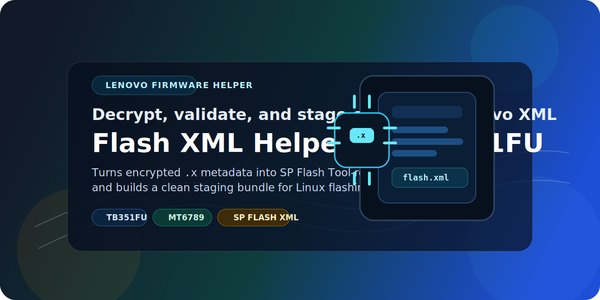

<p align="center">
  
</p>

<h1 align="center">Lenovo Flash XML Helper for TB351FU</h1>

<p align="center">
  A Linux-friendly helper that decrypts Lenovo firmware <code>.x</code> metadata files, validates the resulting XML, and prepares a ready-to-load <code>SP Flash Tool</code> staging bundle for the Lenovo Tab Plus <code>TB351FU</code>.
</p>

<p align="center">
  <strong>TB351FU</strong> • <strong>Encrypted Lenovo firmware</strong> • <strong>SP Flash Tool bundle generation</strong> • <strong>Python helper</strong>
</p>

> [!WARNING]
> This helper validates package structure and prepares usable XML assets, but it does not guarantee a successful flash or a bootable device. Always confirm the firmware matches the exact model before flashing anything.

> [!NOTE]
> Lenovo firmware metadata in this workflow is encrypted as `.x` files. This project decrypts those files into standard XML and stages the support files that `SP Flash Tool` expects.

## Overview

Official Lenovo firmware packages for the `TB351FU` can include encrypted metadata such as `flash.x` and scatter `.x` files. That makes them awkward to use directly with `SP Flash Tool`, even when the payload files themselves are present.

This helper automates the practical parts:

1. Decrypt `flash.x` into `flash.xml`
2. Decrypt the referenced scatter `.x` into scatter XML
3. Decrypt efuse-related XML files when they exist
4. Validate the XML and referenced package files
5. Build a single `sp_flash_tool_bundle/` folder that is easier to load in Linux `SP Flash Tool`

## Highlights

- Decrypts Lenovo `.x` metadata into plain XML
- Validates `flash.xml`, scatter XML, and referenced image files
- Copies support files like `DA_BR.bin`, `da.auth`, and `flash.xsd` when present
- Generates partition exports in `csv`, `json`, and `txt`
- Builds a ready-to-stage `sp_flash_tool_bundle/` directory
- Keeps the original ROM package untouched

## Tested Package

This helper was built around the package:

- `TB351FU_ROW_OPEN_USER_M15125.2_A16_ZUI_17.5.10.073_ST_260213`

Observed values from the decrypted metadata:

- Model code: `TB351FU`
- Project name: `t808aa`
- Platform family: `MT6789`

## Repository Layout

| Path | Purpose |
| --- | --- |
| `run_lenovo_decrypt.py` | Main decrypt, validate, and staging script |
| `install.sh` | Creates `.venv` and installs `pycryptodome` |
| `assets/readme-banner.svg` | README banner artwork |
| `LICENSE` | MIT license |

## Requirements

- Linux environment with `python3`
- `python3 -m venv` support
- Lenovo firmware package that contains an `image/` directory
- Enough free disk space to create decrypted outputs and the staging bundle

## Installation

Before cloning the repo

```bash
sudo apt install python3.13-venv
```
From the repository root:

```bash
bash ./install.sh &&  source venv/bin/activate
```

What this does:

- creates `.venv/`
- upgrades `pip`
- installs `pycryptodome`
- leaves system Python unchanged

## Quick Start

```bash
./venv/bin/python ./run_lenovo_decrypt.py \
  --package-dir ~/Desktop/TB351FU_ROW_OPEN_USER_M15125.2_A16_ZUI_17.5.10.073_ST_260213/TB351FU_ROW_OPEN_USER_M15125.2_A16_ZUI_17.5.10.073_ST_260213 \
  --output-dir ~/Desktop/rom-decrypt
```

If needed, you can pass the password explicitly:

```bash
./venv/bin/python ./run_lenovo_decrypt.py \
  --package-dir ~/Desktop/TB351FU_ROW_OPEN_USER_M15125.2_A16_ZUI_17.5.10.073_ST_260213/TB351FU_ROW_OPEN_USER_M15125.2_A16_ZUI_17.5.10.073_ST_260213 \
  --output-dir ~/Desktop/rom-decrypt \
  --password OSD
```

## Expected ROM Layout

The `--package-dir` should point to the ROM folder itself, and that folder should contain:

```text
ROM_FOLDER/
  image/
    flash.x
    flash.xsd
    *.x
    DA_BR.bin or another DA file
    da.auth
    boot.img / vbmeta.img / super.img / other image files
```

Common path mistake:

- Wrong: `/some/path/new_updated`
- Right: `/some/path/new_updated/TB351FU_ROW_OPEN_USER_M15125.2_A16_ZUI_17.5.10.073_ST_260213`

## What The Helper Generates

Depending on the package contents, the output directory can include:

- `flash.xml`
- `flash.xsd`
- `DA_BR.bin`
- `da.auth`
- `MT6789_Android_scatter.xml`
- `flash_efuse.xml`
- `MT6789_Android_scatter_efuse.xml`
- `validation_report.json`
- `partition_summary.csv`
- `partition_summary.json`
- `partition_summary.txt`

It also creates:

- `sp_flash_tool_bundle/`

That staging folder is the main deliverable for flashing workflows. It includes:

- generated XML files
- copied support files
- partition summaries
- every referenced image file found in the package

## Validation Checks

The helper currently verifies:

- `flash.xml` decrypts and parses correctly
- required flash fields such as project, DA, and scatter are present
- the DA file referenced in `flash.xml` exists
- the scatter XML parses successfully
- partition addresses and sizes use valid hex values
- referenced downloadable image files exist
- address ordering issues are surfaced as warnings in the report

## How To Use With SP Flash Tool

Use the staged file inside `sp_flash_tool_bundle/`, not the raw encrypted metadata from the original package.

Recommended flow:

1. Run the helper
2. Open the generated `sp_flash_tool_bundle/`
3. Load `sp_flash_tool_bundle/flash.xml` into `SP Flash Tool`
4. Keep `flash.xml`, `flash.xsd`, the DA file, and the copied images together in that same folder

## Example Linux SP Flash Tool Command

```bash
LD_LIBRARY_PATH=$PWD/SP_Flash_Tool_v6.2228_Linux:$PWD/SP_Flash_Tool_v6.2228_Linux/lib \
./SP_Flash_Tool_v6.2228_Linux/SPFlashToolV6 \
  -f "/path/to/output/sp_flash_tool_bundle/flash.xml" \
  -c download
```

## Example Workflow

```bash
cd /path/to/lenovo_flash_xml_helper_TB351FU
bash ./install.sh

./.venv/bin/python ./run_lenovo_decrypt.py \
  --package-dir /path/to/TB351FU_ROW_OPEN_USER_M15125.2_A16_ZUI_17.5.10.073_ST_260213 \
  --output-dir ./output/TB351FU_ROW_OPEN_USER_M15125.2_A16_ZUI_17.5.10.073_ST_260213
```

## Troubleshooting

If install fails:

- confirm `python3 -m venv` works on your system
- rerun `bash ./install.sh`

If decrypt fails:

- confirm `--package-dir` points to the ROM folder, not its parent
- confirm `image/flash.x` exists
- try `--password OSD`

If SP Flash Tool reports invalid XML:

- load the staged `sp_flash_tool_bundle/flash.xml`
- make sure `flash.xsd` is present beside it
- make sure the DA file and referenced images are in the same folder

If you want to inspect the details:

- open `validation_report.json`
- review `partition_summary.txt` for a quick partition overview

## Use Case

This repository is especially useful when you want to generate the XML and support files needed by Linux `SP Flash Tool` or by a higher-level Lenovo flashing or unlock workflow that expects decrypted assets.

## Acknowledgements

Special thanks to:

- `mtkclient` for the broader MediaTek tooling and research ecosystem around these devices
- Linux `SP Flash Tool` for the downstream flashing workflow this helper prepares files for

## License

This repository is released under the MIT License. It does not redistribute Lenovo firmware contents; you must provide your own official package files.
